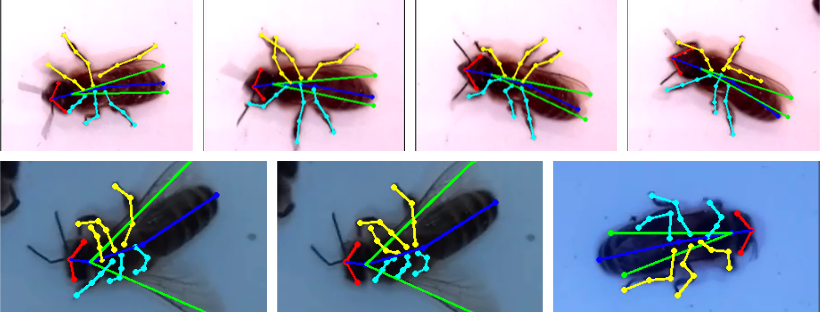
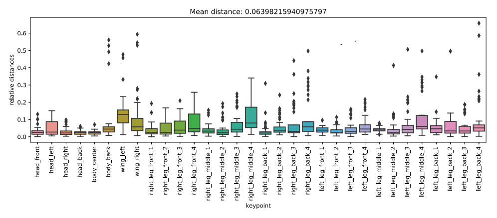
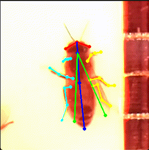
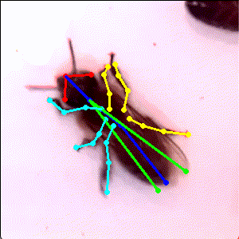

# apic.ai bee pose dataset

The apic.ai bee pose dataset contains annotations of 32 relevant keypoints on western honey bees. Explicitly inferring the pose is beneficial for the identification of behavioral anomalies such as trembling after poisoning or infections.



<details><summary>Table of Contents</summary><p>

* [Why we created the apic.ai bee pose dataset](#why-we-created-the-apicai-bee-pose-dataset)
* [Get the Dataset](#get-the-dataset)
* [Labels](#labels)
* [Visualization](#visualization)
* [Benchmark](#benchmark)
* [Contributing](#contributing)
* [Citing the apic.ai bee pose dataset](#citing-the-apicai-bee-pose-dataset)
* [Related publications](related-publications)
* [License](#licensetoc)
* [Contact](#contact)
</p></details><p></p>

## Why we created the apic.ai bee pose dataset

In recent years, entomologists have been observing a global decline in the population of pollinating insects. This is of considerable concern since the global agricultural industry is heavily dependent on pollination.
One rather prominent representative of the species affected is the western honey bee (<i>apis mellifera</i>). Unfortunately, the phenomenon cannot be traced to a single root cause. Recent research on honey bee population decline and colony collapse disorder (CCD) is suggesting a multitude of influencing factors. Namely harmful pesticides, parasites, diseases, malnutrition and intruders. Furthermore urbanization and intensive monoculture cultivation are man-made causes. The collapse of a colony is likely caused by a combination of these factors. A deeper understanding of the ecosystem and human impact on nature is required, to provide a basis for the development for targeted countermeasures. In order to improve the situation, it is necessary to integrate this knowledge in short and long-term decisionmaking.
The recognition and analysis of changes in behavioral patterns as a consequence of external influences could yield mayor insights into the causal relationships. To contribute to this advancement of knowledge, [we](https://apic.ai) are releasing a dataset about bee pose analysis. It is our hope that it will provide a basis for the computer science community to help solve the challenge.

## Get the dataset

First clone this repository.

```bash
git clone https://github.com/apic-ai/apic-bee-pose-dataset.git
cd apic-bee-pose-dataset
```

| Xtrain        | Xtest         | X     |
| ------------- |:-------------:| -----:|
| 191           | 38            | 229   |

### Labels

The bee pose is marked by 32 relevant keypoints.


<details><summary>Color definition</summary><p>

```python
head_color = (0, 0, 255)
body_color = (255, 0, 0)
wing_color = (0, 255, 0)
left_leg_color = (0, 255, 255)
right_leg_color = (255, 255, 0)
```
</p></details><p></p>


<details><summary>Keypoint definition</summary><p>

```python
{
   "0":{
      "name":"head_front",
      "color":head_color
   },
   "1":{
      "name":"head_left",
      "color":head_color
   },
   "2":{
      "name":"head_right",
      "color":head_color
   },
   "3":{
      "name":"head_back",
      "color":body_color
   },
   "4":{
      "name":"body_center",
      "color":body_color
   },
   "5":{
      "name":"body_back",
      "color":body_color
   },
   "6":{
      "name":"wing_left",
      "color":wing_color
   },
   "7":{
      "name":"wing_right",
      "color":wing_color
   },
   "8":{
      "name":"right_leg_front_1",
      "color":right_leg_color
   },
   "9":{
      "name":"right_leg_front_2",
      "color":right_leg_color
   },
   "10":{
      "name":"right_leg_front_3",
      "color":right_leg_color
   },
   "11":{
      "name":"right_leg_front_4",
      "color":right_leg_color
   },
   "12":{
      "name":"right_leg_middle_1",
      "color":right_leg_color
   },
   "13":{
      "name":"right_leg_middle_2",
      "color":right_leg_color
   },
   "14":{
      "name":"right_leg_middle_3",
      "color":right_leg_color
   },
   "15":{
      "name":"right_leg_middle_4",
      "color":right_leg_color
   },
   "16":{
      "name":"right_leg_back_1",
      "color":right_leg_color
   },
   "17":{
      "name":"right_leg_back_2",
      "color":right_leg_color
   },
   "18":{
      "name":"right_leg_back_3",
      "color":right_leg_color
   },
   "19":{
      "name":"right_leg_back_4",
      "color":right_leg_color
   },
   "20":{
      "name":"left_leg_front_1",
      "color":left_leg_color
   },
   "21":{
      "name":"left_leg_front_2",
      "color":left_leg_color
   },
   "22":{
      "name":"left_leg_front_3",
      "color":left_leg_color
   },
   "23":{
      "name":"left_leg_front_4",
      "color":left_leg_color
   },
   "24":{
      "name":"left_leg_middle_1",
      "color":left_leg_color
   },
   "25":{
      "name":"left_leg_middle_2",
      "color":left_leg_color
   },
   "26":{
      "name":"left_leg_middle_3",
      "color":left_leg_color
   },
   "27":{
      "name":"left_leg_middle_4",
      "color":left_leg_color
   },
   "28":{
      "name":"left_leg_back_1",
      "color":left_leg_color
   },
   "29":{
      "name":"left_leg_back_2",
      "color":left_leg_color
   },
   "30":{
      "name":"left_leg_back_3",
      "color":left_leg_color
   },
   "31":{
      "name":"left_leg_back_4",
      "color":left_leg_color
   }
}
```
</p></details><p></p>


<details><summary>Skeleton model definition</summary><p>

```python
[
   [
      "head_front",
      "head_left",
      head_color,
      50
   ],
   [
      "head_front",
      "head_right",
      head_color,
      50
   ],
   [
      "head_front",
      "head_back",
      body_color,
      50
   ],
   [
      "head_back",
      "body_center",
      body_color,
      80
   ],
   [
      "body_center",
      "body_back",
      body_color,
      200
   ],
   [
      "wing_left",
      "head_back",
      wing_color,
      200
   ],
   [
      "wing_right",
      "head_back",
      wing_color,
      200
   ],
   [
      "right_leg_front_1",
      "right_leg_front_2",
      right_leg_color,
      40
   ],
   [
      "right_leg_front_2",
      "right_leg_front_3",
      right_leg_color,
      40
   ],
   [
      "right_leg_front_3",
      "right_leg_front_4",
      right_leg_color,
      60
   ],
   [
      "right_leg_middle_1",
      "right_leg_middle_2",
      right_leg_color,
      50
   ],
   [
      "right_leg_middle_2",
      "right_leg_middle_3",
      right_leg_color,
      50
   ],
   [
      "right_leg_middle_3",
      "right_leg_middle_4",
      right_leg_color,
      70
   ],
   [
      "right_leg_back_1",
      "right_leg_back_2",
      right_leg_color,
      60
   ],
   [
      "right_leg_back_2",
      "right_leg_back_3",
      right_leg_color,
      60
   ],
   [
      "right_leg_back_3",
      "right_leg_back_4",
      right_leg_color,
      80
   ],
   [
      "left_leg_front_1",
      "left_leg_front_2",
      left_leg_color,
      40
   ],
   [
      "left_leg_front_2",
      "left_leg_front_3",
      left_leg_color,
      40
   ],
   [
      "left_leg_front_3",
      "left_leg_front_4",
      left_leg_color,
      60
   ],
   [
      "left_leg_middle_1",
      "left_leg_middle_2",
      left_leg_color,
      50
   ],
   [
      "left_leg_middle_2",
      "left_leg_middle_3",
      left_leg_color,
      50
   ],
   [
      "left_leg_middle_3",
      "left_leg_middle_4",
      left_leg_color,
      70
   ],
   [
      "left_leg_back_1",
      "left_leg_back_2",
      left_leg_color,
      60
   ],
   [
      "left_leg_back_2",
      "left_leg_back_3",
      left_leg_color,
      60
   ],
   [
      "left_leg_back_3",
      "left_leg_back_4",
      left_leg_color,
      80
   ]
]
```
</p></details><p></p>


A definition that is usable in python can be found in [utils/definitions.py](utils/definitions.py). It can be used as a lookup table.

## Visualization

```python3
python3 plotPose.py ./data/pose/Biene_stirbt_bee_id2003_f0130.png ./data/pose_dataset.json
```

## Benchmark
As a benchmark we recommend to use the keypoint detection Object Keypoint Similarity (OKS).
```latex
OKS = Σi[exp(-di2/2s2κi2)δ(vi>0)] / Σi[δ(vi>0)]
```

If you use this data as a benchmark, please create a pull request and update this benchmark section with your results.

### Results of our DeepBees Multinet
In our paper [DeepBees](http://openaccess.thecvf.com/content_ICCVW_2019/papers/CVWC/Marstaller_DeepBees_-_Building_and_Scaling_Convolutional_Neuronal_Nets_For_Fast_ICCVW_2019_paper.pdf), we defined the custom loss as follows.



## Contributing

Thanks for your interest in contributing! There are many ways to get involved; start with our [contributor guidelines](/CONTRIBUTING.md) and then check these [open issues](https://github.com/apic-ai/apic-bee-pose-dataset/issues) for specific tasks.

## Citing the apic.ai bee pose dataset
If you use our dataset in a scientific publication, we would appreciate references to the following paper:

**[DeepBees – Building and Scaling Convolutional Neuronal Nets For Fast and Large-scale Visual Monitoring of Bee Hives](http://openaccess.thecvf.com/content_ICCVW_2019/papers/CVWC/Marstaller_DeepBees_-_Building_and_Scaling_Convolutional_Neuronal_Nets_For_Fast_ICCVW_2019_paper.pdf)**

Bibtex entry:
```latex
@inproceedings{marstaller2019deepbees,
  title={DeepBees-Building and Scaling Convolutional Neuronal Nets For Fast and Large-Scale Visual Monitoring of Bee Hives},
  author={Marstaller, Julian and Tausch, Frederic and Stock, Simon},
  booktitle={Proceedings of the IEEE International Conference on Computer Vision Workshops},
  pages={0--0},
  year={2019}
}
```

Otherwise use the following attribution:
```
apic.ai bee pose dataset
by apic.ai GmbH
```

## Related publications

- [Fast animal pose estimation using deep neural networks](https://www.biorxiv.org/content/10.1101/331181v1)
- [Impact of an Oomen feeding with a neonicotinoid on daily activity and colony development of honeybees assessed with an AI based monitoring device](https://www.biorxiv.org/content/10.1101/2020.02.04.933556v1)
- [Current achievements and future developments of a novel AI based visual monitoring of beehives in ecotoxicology and for the monitoring of landscape structures.](https://www.biorxiv.org/content/10.1101/2020.02.04.933580v1)

# License
The [Attribution-NonCommercial-ShareAlike 4.0 (CC BY-NC-SA 4.0)](LICENSE), Copyright © [2020] [apic.ai GmbH](https://www.apic.ai)

## Contact
If you have questions regarding the dataset or license feel free to contact: data@apic.ai


